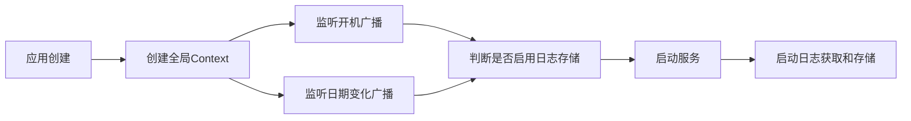

# LogCatcher

客户需求，需要自动抓取 Log 存放到 `/sdcard/oem_log` 中

并且只保留 7 天

每天的日志单个文件最大 `300M` 

超过则停止记录

### Logcatcher

```mermaid
graph LR;
	应用创建 --> 创建全局Context --> 监听开机广播 --> 判断是否启用日志存储 --> 启动服务 --> 启动日志获取和存储;
	创建全局Context --> 监听日期变化广播 --> 判断是否启用日志存储;
```
